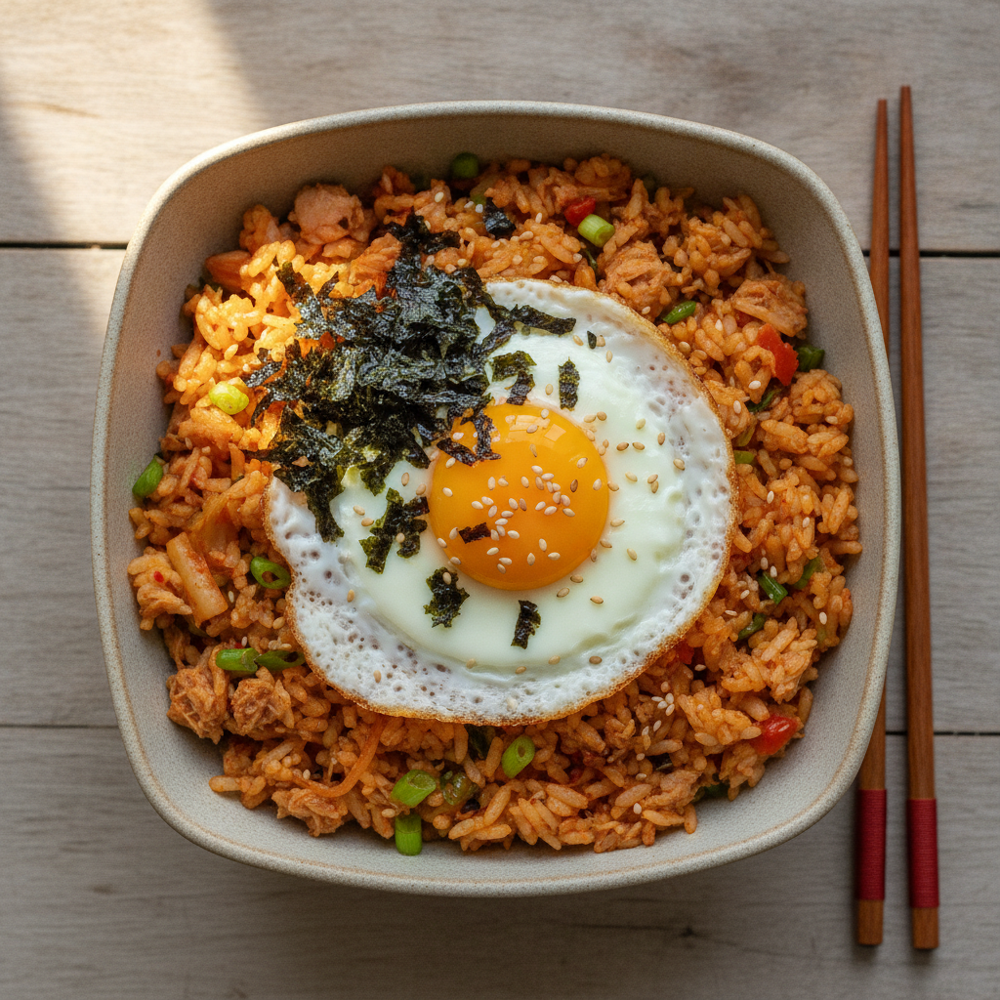

# 참치 김치볶음밥 (15분 완성)

간단하고 빠르게 만들 수 있는 저녁 메뉴예요.

## 재료 (1인분)

- 밥 1공기
- 신김치 1/2컵 (잘게 썰기)
- 참치캔 1/2캔 (기름 제거)
- 대파 약간
- 식용유 1큰술
- 고추장 1작은술
- 설탕 1/2작은술
- 간장 1작은술
- 계란 1개 (선택)
- 김가루, 참기름 약간

## 조리 순서

1. 팬에 식용유를 두르고 대파를 넣어 파기름을 낸다. (1분)
2. 썰어둔 김치를 넣고 중불에서 볶는다. (2분)
3. 고추장, 설탕, 간장을 넣고 함께 볶는다. (2분)
4. 기름을 뺀 참치를 넣고 살짝 더 볶는다. (1분)
5. 밥을 넣고 재료와 골고루 섞이도록 강불에서 볶는다. (3~4분)
6. 불을 끄고 참기름과 김가루를 뿌려 마무리한다.
7. (선택) 계란 프라이를 올려 완성한다.

## 팁

- 신김치를 사용해야 깊은 맛이 난다.
- 밥은 살짝 식은 찬밥을 쓰면 더 고슬고슬하게 볶인다.
- 칠리소스를 추가해서 먹으니 맛있었다.
