# Playwright MCP 브라우저 자동화 챌린지 리서치

- **일자**: 2026-09-05 (KST)
- **도구**: Claude Code + Playwright MCP (Chromium)
- **주제**: 실제 서비스 화면을 에이전트가 직접 열고 · 조작하고 · 캡처하기
- **원본 로그**: [logs/](../logs/) (콘솔 로그 + 접근성 스냅샷)

---

## 요약

| # | 챌린지 | 대상 링크 | 시각(KST) | 결과 |
|---|--------|-----------|-----------|------|
| 1 | 네이버 날씨 검색 & 캡처 | [search.naver.com](https://search.naver.com/search.naver?query=오늘날씨) | 14:54 | ✅ 전체/영역 캡처 성공 |
| 2 | 구글폼 자동 작성 & 제출 | [구글폼](https://docs.google.com/forms/d/e/1FAIpQLSfKyhtnKbiLrbZ3I6iaY5M2EBPVjOrlHnAWuOUFQvTzfo-g0w/viewform) | 14:59 | ✅ 제출 완료 |
| 3 | 네이버 카페 홈 (비로그인 → 로그인) | [cafe.naver.com](https://cafe.naver.com) | 15:03 / 15:11 | ✅ 로그인 상태 확인 |
| 4 | 플리마켓 검색 + 낮은 가격순 정렬 | [fleamarket.naver.com](https://fleamarket.naver.com/search?q=%EC%B0%A8%EB%9F%89%EC%9A%A9+%ED%95%B8%EB%93%9C%ED%8F%B0+%EA%B1%B0%EC%B9%98%EB%8C%80&sort=PRICE_ASC) | 15:13 | ✅ 정렬 적용 확인 |
| 5 | 쿠팡 (회원가입 화면 / 홈) | [coupang.com](https://www.coupang.com) | 15:21 | ⚠️ 회원가입 화면 경유 후 홈 진입 |
| 6 | 인스타그램 | [instagram.com](https://www.instagram.com/) | 15:28 | ⚠️ 로그인 벽 |
| 7 | 유튜브 홈 | [youtube.com](https://www.youtube.com/) | 15:35 | ⚠️ 비로그인 → 추천 피드 없음 |

---

## 1. 네이버 날씨 검색 & 캡처

- **링크**: https://search.naver.com/search.naver?query=오늘날씨
- **한 일**: 네이버 검색창에 `오늘날씨` 입력 → 검색 결과 진입 → 전체 페이지 캡처 후 날씨 카드만 영역 캡처
- **관찰**: 서초구 잠원동 기준 **28.4°(구름많음, 체감 26.9°, 습도 39%)**, 미세/초미세 좋음, 일몰 18:56, 주간예보 9.05~9.14까지 노출

<a href="../screenshots/naver-weather-2026-09-05.png">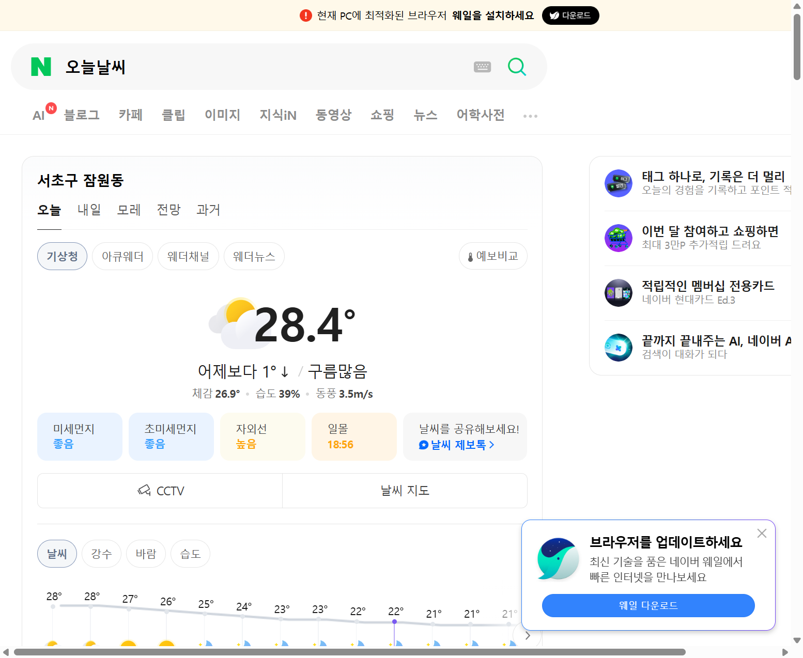</a>
<a href="../screenshots/naver-weather-card-2026-09-05.png">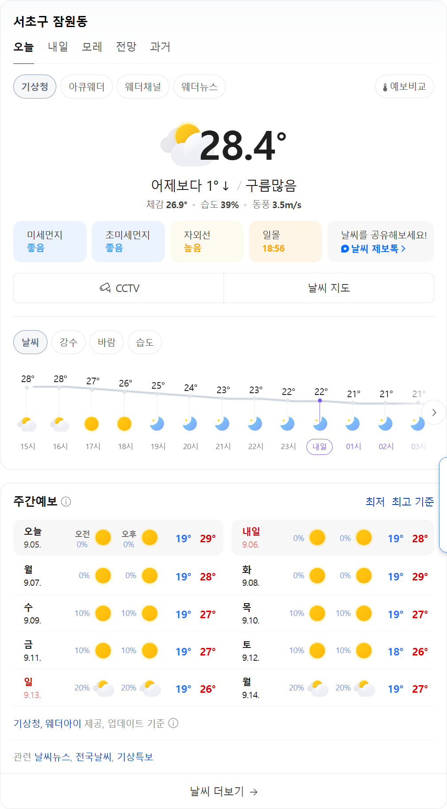</a>

| 파일 | 설명 |
|------|------|
| [naver-weather-2026-09-05.png](../screenshots/naver-weather-2026-09-05.png) | 검색 결과 전체 화면 |
| [naver-weather-card-2026-09-05.png](../screenshots/naver-weather-card-2026-09-05.png) | 날씨 카드 **엘리먼트 단위** 캡처 |

> 💡 포인트: 전체 스크린샷보다 **특정 엘리먼트만 지정해 캡처**하면 광고·배너가 빠져 결과물이 훨씬 깔끔하다.

---

## 2. 구글폼 자동 작성 & 제출

- **링크**: https://docs.google.com/forms/d/e/1FAIpQLSfKyhtnKbiLrbZ3I6iaY5M2EBPVjOrlHnAWuOUFQvTzfo-g0w/viewform
- **폼 제목**: AI 공장장 4기 — 구글폼 자동 작성 실습 (로그인 없이 제출 가능)
- **입력값**
  - 이름: `Claude (AI 에이전트)`
  - 이번 주 목표: `Playwright MCP로 브라우저 자동화 익히기 — 네이버 검색/스크린샷, 구글폼 자동 작성까지 실습 완주`
  - 이번 주 수업 만족도(1~5): `4`
- **결과**: "응답이 기록되었습니다." 확인 페이지 도달 → 제출 성공

<a href="../screenshots/gform-before-submit.png">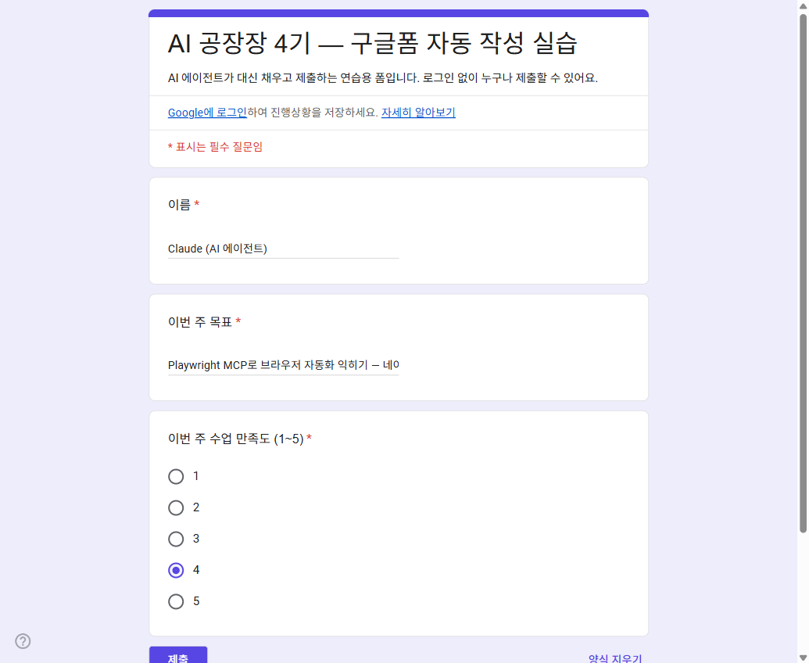</a>
<a href="../screenshots/gform-submitted.png">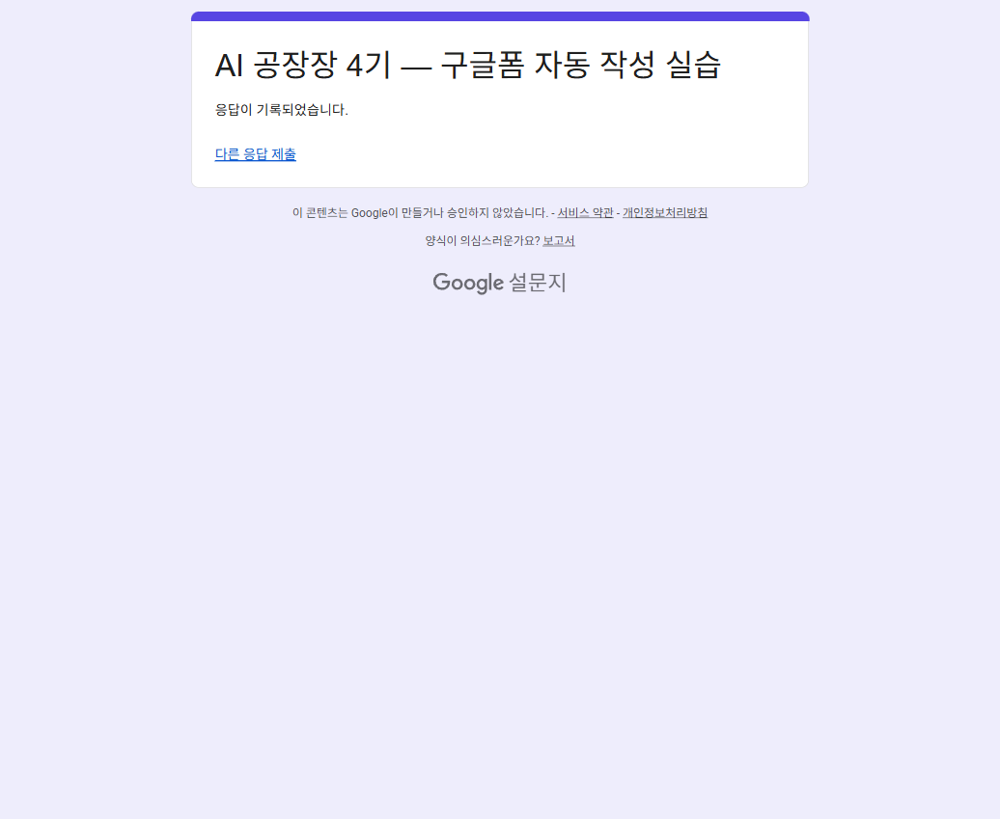</a>

| 파일 | 설명 |
|------|------|
| [gform-before-submit.png](../screenshots/gform-before-submit.png) | 값이 모두 채워진 제출 직전 상태 |
| [gform-submitted.png](../screenshots/gform-submitted.png) | 제출 완료 확인 화면 |

> 💡 포인트: 텍스트 입력 + 라디오 선택 + 제출까지 한 번에 되는, 자동화 실습용으로 가장 안정적인 시나리오.

---

## 3. 네이버 카페 홈 (비로그인 → 로그인)

- **링크**: https://cafe.naver.com
- **한 일**: 비로그인 상태 카페홈 캡처 → 네이버 로그인 → 로그인 상태 카페홈 재캡처
- **관찰**: 로그인 후 우측에 `kiy3564님` 프로필·로그아웃·카페 만들기 노출, "가입한 카페가 없습니다" 표시로 **세션이 실제로 붙었음**이 확인됨

<a href="../screenshots/naver-cafe-home.png">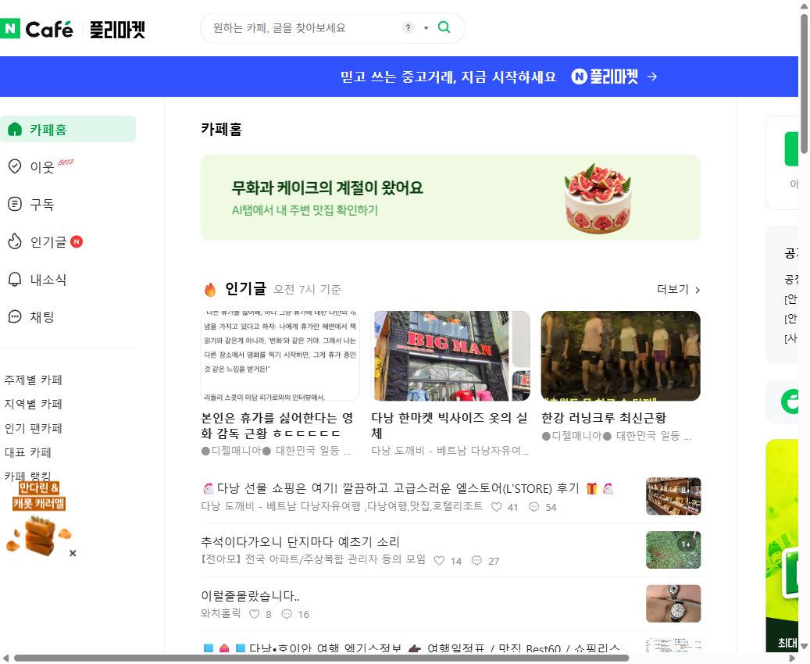</a>
<a href="../screenshots/cafe-home-2.png">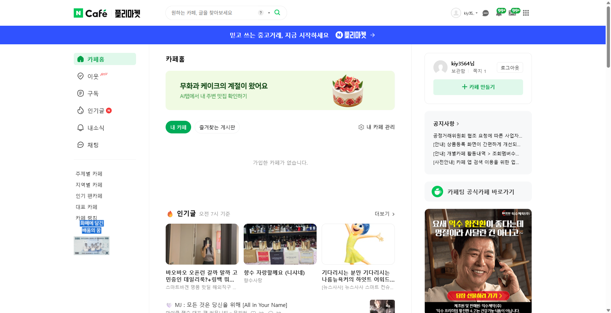</a>

| 파일 | 설명 |
|------|------|
| [naver-cafe-home.png](../screenshots/naver-cafe-home.png) | 비로그인 상태 카페홈 |
| [cafe-home-2.png](../screenshots/cafe-home-2.png) | 로그인 상태 카페홈 (계정 영역 노출) |

> 💡 포인트: 로그인 여부는 화면 상단/우측 **계정 영역 존재**로 판별하는 게 가장 확실하다.

---

## 4. 네이버 플리마켓 — 검색 + 낮은 가격순 정렬

- **링크**: https://fleamarket.naver.com/search?q=차량용+핸드폰+거치대&sort=PRICE_ASC
- **한 일**: 검색어 `차량용 핸드폰 거치대` 입력 → 안전거래 상품 탭 → 정렬을 **낮은 가격순**으로 변경
- **관찰**: 정렬 적용 후 상위 노출 상품이 모두 5,000원대(배송비 3,500~3,600원 별도), 구매자 보호 수수료 2.2% 별도 안내 확인

<a href="../screenshots/fleamarket-holder-price-asc.png">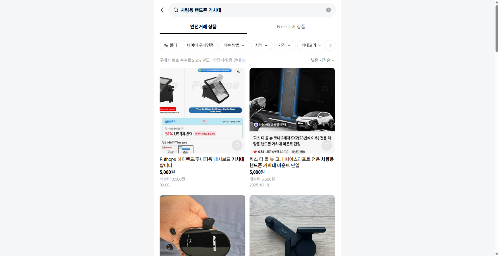</a>

| 파일 | 설명 |
|------|------|
| [fleamarket-holder-price-asc.png](../screenshots/fleamarket-holder-price-asc.png) | 낮은 가격순 정렬이 적용된 검색 결과 |

> 💡 포인트: 정렬·필터는 UI 클릭 대신 **URL 쿼리(`sort=PRICE_ASC`)로 바로 진입**하는 편이 빠르고 재현성이 높다.

---

## 5. 쿠팡 (회원가입 화면 → 홈)

- **링크**: https://www.coupang.com
- **관찰**: 접근 과정에서 회원가입/약관 동의 화면(login.coupang.com)을 먼저 만났고, 이후 홈 진입에 성공. 홈에서는 "최대 32,000원 한정 쿠폰", 로켓배송/로켓프레시/2026 추석 등 카테고리 배너 확인
- **주의**: 쿠팡은 봇 탐지·리다이렉트가 잦은 편이라 **같은 흐름이 매번 재현되지 않을 수 있음**

<a href="../screenshots/coupang-home.png">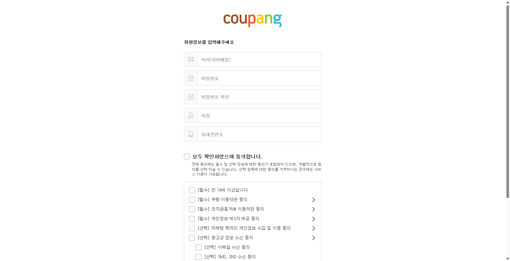</a>
<a href="../screenshots/coupang-home-2.png">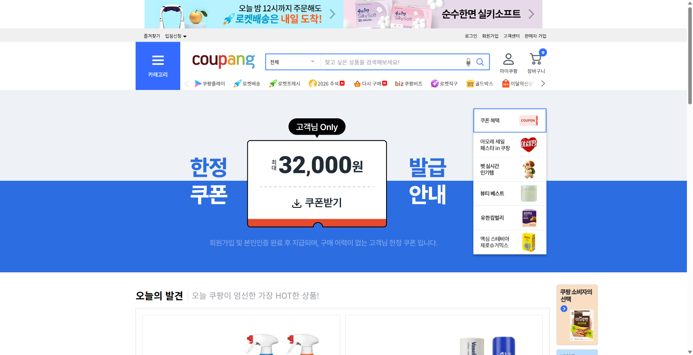</a>

| 파일 | 설명 |
|------|------|
| [coupang-home.png](../screenshots/coupang-home.png) | 회원정보 입력/약관 동의 화면 |
| [coupang-home-2.png](../screenshots/coupang-home-2.png) | 쿠팡 홈 (쿠폰 배너·오늘의 발견) |

> ⚠️ 회원가입·결제처럼 **실제 계정이 만들어지는 흐름은 자동화하지 않는 것**이 원칙. 캡처까지만 진행했다.

---

## 6. 인스타그램

- **링크**: https://www.instagram.com/
- **관찰**: 비로그인 접근 시 곧바로 로그인 화면. 피드 대신 로그인 폼 + "새 계정 만들기" + Facebook 로그인만 노출되어 **로그인 없이는 콘텐츠 자동화 불가**

<a href="../screenshots/instagram-home.png">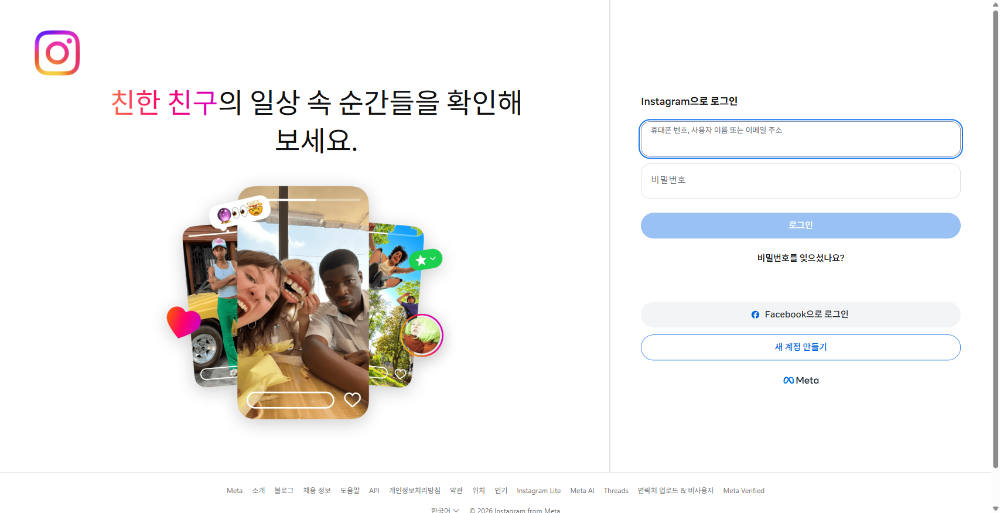</a>

| 파일 | 설명 |
|------|------|
| [instagram-home.png](../screenshots/instagram-home.png) | 로그인 벽 화면 |

---

## 7. 유튜브 홈

- **링크**: https://www.youtube.com/
- **관찰**: 비로그인 상태라 추천 피드가 비어 있고 **"검색하여 시작하기"** 안내만 표시. 좌측 내비게이션(홈/Shorts/구독/기록)은 정상 렌더링

<a href="../screenshots/youtube-home.png">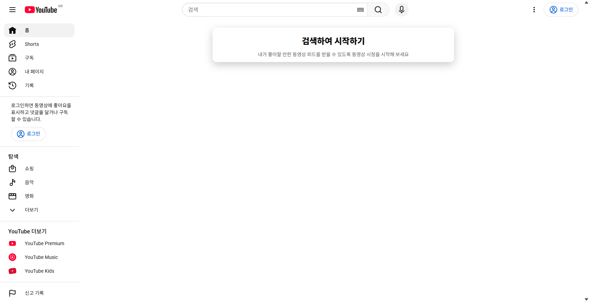</a>

| 파일 | 설명 |
|------|------|
| [youtube-home.png](../screenshots/youtube-home.png) | 비로그인 유튜브 홈 |

---

## 배운 점 정리

1. **로그인 여부가 결과를 좌우한다.** 네이버 카페는 로그인 후 화면이 완전히 달라졌고, 인스타·유튜브는 비로그인이면 볼 게 없다.
2. **엘리먼트 캡처 > 전체 캡처.** 날씨 카드처럼 필요한 영역만 잡으면 광고가 섞이지 않는다.
3. **URL 파라미터가 클릭보다 안정적이다.** 검색어·정렬(`sort=PRICE_ASC`)은 URL로 바로 진입하는 게 재현성이 높다.
4. **폼 자동화는 구글폼이 최고의 연습 상대.** 로그인 불필요 + 제출 확인 페이지가 명확해 성공/실패 판정이 쉽다.
5. **커머스/SNS는 봇 탐지에 민감하다.** 쿠팡처럼 리다이렉트가 끼어들 수 있으니 실패를 전제로 단계를 나눠 진행한다.
6. **계정 생성·결제·대량 요청은 하지 않는다.** 조회와 캡처 중심으로만 실습.
