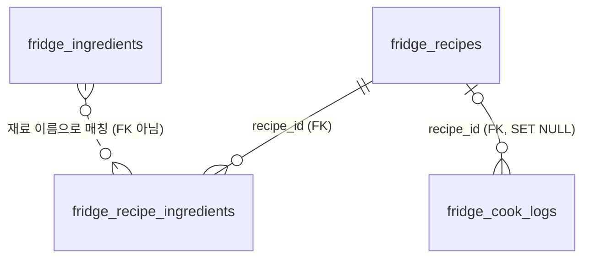

# 🍳 냉장고 요리사

냉장고에 남은 재료를 관리하고, **그 재료로 지금 만들 수 있는 레시피**를 찾아주는 웹앱입니다.
마음에 드는 레시피가 없으면 **AI가 냉장고 재료에 맞춰 새 레시피를 만들어** DB에 저장합니다.
부족한 재료는 장보기 목록으로 바로 담을 수 있습니다.

**배포 주소 → https://fridge-chef-rho-six.vercel.app**

---

## 기술 스택

| 구분 | 사용 기술 |
|---|---|
| 프론트엔드 | React 18 (CDN) · Babel Standalone 7 · Tailwind CSS 3.4 — 빌드 도구 없는 단일 `index.html` |
| 백엔드 | Node.js · Express 5 — 단일 `server.js` |
| 데이터베이스 | Supabase PostgreSQL (`pg` 드라이버, Transaction Pooler 6543) |
| AI | OpenAI `gpt-4o-mini` — Structured Outputs로 레시피 생성 |
| 배포 | Vercel (서버리스 함수 + 정적 호스팅) |

라우팅은 외부 라이브러리 없이 **해시 기반 라우터를 직접 구현**했습니다 (`#/recipes/3` 같은 동적 파라미터 지원).

---

## 파일 구조

```
week-4/quest/
├── index.html        # 프론트엔드 전체 (React 컴포넌트 · 라우터 · API 클라이언트)
├── server.js         # 백엔드 전체 (API · 스키마 생성 · 시드 데이터)
├── package.json      # 의존성 (express, pg, dotenv)
├── vercel.json       # 배포 설정 (/api → server.js, 그 외 → index.html)
├── .env.example      # 환경변수 템플릿
└── .env              # 실제 연결 정보 (git 제외)
```

프론트엔드 1파일 + 백엔드 1파일 구조입니다.

---

## 실행 방법

### 1. 의존성 설치

```bash
cd week-4/quest
npm install
```

### 2. 환경변수 설정

`.env.example`을 복사해 `.env`를 만들고 실제 연결 문자열을 넣습니다.

```bash
cp .env.example .env
```

```ini
DATABASE_URL=postgresql://<user>:<password>@<host>:6543/postgres
PORT=3000

OPENAI_API_KEY=sk-proj-...
OPENAI_MODEL=gpt-4o-mini
```

> `DATABASE_URL`은 Supabase 대시보드 → **Settings → Database → Connection string → Transaction pooler**에서,
> `OPENAI_API_KEY`는 [platform.openai.com/api-keys](https://platform.openai.com/api-keys)에서 발급합니다.
> `.env`는 `.gitignore`에 포함되어 커밋되지 않으며, **API 키는 서버에서만 사용되고 브라우저로 전달되지 않습니다.**
> `OPENAI_API_KEY`가 없어도 AI 생성 기능만 비활성화될 뿐 나머지는 정상 동작합니다.

### 3. DB 초기화 (최초 1회)

```bash
npm run seed
```

테이블을 만들고 시드 데이터(재료 18건 · 레시피 6건)를 넣습니다.
**이미 데이터가 있으면 건너뛰므로 여러 번 실행해도 중복되지 않습니다.**

### 4. 서버 실행

```bash
npm start
```

→ http://localhost:3000

서버를 그냥 실행해도 스키마·시드는 자동으로 준비되므로, 3번을 건너뛰고 바로 4번만 해도 됩니다.

---

## 화면

| 경로 | 화면 | 주요 기능 |
|---|---|---|
| `/#/` | 내 냉장고 | 재고 요약, 유통기한 임박 알림, 검색·분류·정렬, 재료 추가/**수정**/삭제 |
| `/#/recipes` | 레시피 | 재료 보유율순 정렬, "지금 만들 수 있는 것만"·**즐겨찾기** 필터, 통합 검색, **AI 레시피 생성** |
| `/#/recipes/:id` | 레시피 상세 | 보유/부족 재료 구분, 조리 순서, 부족 재료 일괄 담기, 즐겨찾기, **요리 완료(재료 차감 + 기록)**, AI 레시피 삭제 |
| `/#/shopping` | 장보기 | 체크리스트, 직접 추가, 구매 완료 항목 비우기, **구매한 항목 냉장고에 넣기** |

### 핵심 로직 두 가지

**1. 유통기한 D-day**
재료의 `expiry`를 오늘 날짜와 비교해 남은 일수를 계산하고, 구간별로 색을 다르게 보여줍니다.

| 남은 일수 | 표시 | 색 |
|---|---|---|
| 0일 미만 | `N일 지남` | 빨강 |
| 0일 | `오늘까지` | 빨강 |
| 1~2일 | `D-1` ~ `D-2` | 주황 |
| 3~5일 | `D-3` ~ `D-5` | 노랑 |
| 6일 이상 | `D-N` | 회색 |

**2. 레시피 매칭**
레시피에 필요한 재료 이름과 냉장고에 있는 재료 이름을 대조해 **보유율(%)** 과 **부족한 재료**를 계산합니다.
부족한 재료가 하나도 없으면 `지금 가능` 뱃지가 붙습니다.

---

## AI 레시피 생성

레시피 화면의 **✨ AI로 레시피 만들기** 버튼으로 새 레시피를 만들어 DB에 저장합니다.

### 동작 순서

```
브라우저                 서버(server.js)              OpenAI          Supabase
   │  POST /api/recipes/generate │                      │                │
   │ ──────────────────────────▶ │                      │                │
   │                             │ 냉장고 재료 조회 ────────────────────▶ │
   │                             │ 레시피 생성 요청 ───▶ │                │
   │                             │ ◀─────── JSON 응답   │                │
   │                             │ 검증 후 트랜잭션 저장 ───────────────▶ │
   │ ◀────── 저장된 레시피 201   │                      │                │
```

- **API 키는 서버에만 있습니다.** 브라우저는 자신의 서버(`/api`)만 호출하고, OpenAI 호출은 전부 서버가 대행합니다.
- **냉장고 재료는 클라이언트가 아니라 서버가 DB에서 직접 읽습니다.** 클라이언트가 보낸 재료 목록을 믿지 않습니다.
- **Structured Outputs**(`response_format: json_schema`, `strict: true`)를 사용해 항상 정해진 형태의 JSON을 받습니다.
- 받은 JSON은 그대로 저장하지 않고 **한 번 더 검증·보정**합니다 (문자열 길이 제한, 숫자 범위 클램핑, 난이도 값 검사, 빈 배열 차단).
- 레시피와 재료는 **하나의 트랜잭션**(`BEGIN`/`COMMIT`)으로 저장해, 중간에 실패하면 둘 다 롤백됩니다.

### 옵션

| 옵션 | 설명 |
|---|---|
| 냉장고 재료 활용하기 | 체크하면 보관 중인 재료 목록을 AI에게 전달합니다 (유통기한 임박순) |
| 원하는 요리 | 자유 입력 (300자 이내). 비워두면 무난한 요리를 제안합니다 |

생성된 레시피에는 `is_ai` 플래그가 붙어 목록과 상세에서 **`✨ AI`** 뱃지로 구분되며, **AI 레시피만 삭제 버튼이 노출**됩니다. 기본 제공 레시피 6개는 삭제할 수 없습니다.

### 오류 처리

| 상황 | 응답 |
|---|---|
| 키 미설정 | `503` OPENAI_API_KEY 가 설정되지 않았습니다 |
| 인증 실패 | `502` OpenAI 인증에 실패했습니다 |
| 요청 한도 초과 | `502` OpenAI 요청 한도를 초과했습니다 |
| 45초 초과 | `502` AI 응답이 너무 오래 걸려 취소했습니다 |
| 항목 누락 | `502` AI가 만든 레시피에 빠진 항목이 있어 저장하지 못했습니다 |

---

## API 명세

모든 응답은 다음 구조를 따릅니다.

```json
{ "success": true,  "data": ... }
{ "success": false, "message": "오류 메시지" }
```

### 재료

| 메서드 | 경로 | 요청 body | 응답 |
|---|---|---|---|
| `GET` | `/api/ingredients` | — | `200` 재료 배열 (유통기한 임박순) |
| `POST` | `/api/ingredients` | `{ name, emoji, category, qty, unit, place, expiry }` | `201` 생성된 재료 |
| `PATCH` | `/api/ingredients/:id` | 바꿀 필드만 (예: `{ qty: 3 }`) | `200` 수정된 재료 / `404` 없는 id |
| `DELETE` | `/api/ingredients/:id` | — | `200` `{ id }` / `404` 없는 id |

`name`·`category`·`expiry`(`YYYY-MM-DD`)는 필수입니다. 추가할 때 `place`가 `냉장`·`냉동`·`실온` 외의 값이면 `냉장`으로 처리하지만, **수정할 때는 `400` 오류**를 돌려줍니다.

### 레시피

| 메서드 | 경로 | 요청 body | 응답 |
|---|---|---|---|
| `GET` | `/api/recipes` | — | `200` 레시피 배열 (각 항목에 재료 목록 포함) |
| `GET` | `/api/recipes/:id` | — | `200` 레시피 1건 / `404` 없는 id |
| `POST` | `/api/recipes/generate` | `{ useFridge, request }` | `201` AI가 만들어 저장한 레시피 |
| `PATCH` | `/api/recipes/:id` | `{ is_favorite: true }` | `200` `{ id, is_favorite }` |
| `POST` | `/api/recipes/:id/cook` | `{ uses: [{ ingredientId, amount }] }` | `201` `{ updated, deleted, cook_count, last_cooked }` |
| `DELETE` | `/api/recipes/:id` | — | `200` `{ id }` / `404` 없는 id |

레시피 응답에는 `is_favorite`, `cook_count`(만든 횟수), `last_cooked`(마지막으로 만든 날)가 함께 옵니다.
`cook`은 재료 행마다 `amount`만큼 수량을 빼고, 0이 되면 냉장고에서 삭제한 뒤 요리 기록을 남깁니다.

### 장보기

| 메서드 | 경로 | 요청 body | 응답 |
|---|---|---|---|
| `GET` | `/api/shopping` | — | `200` 장보기 배열 |
| `POST` | `/api/shopping` | `{ names: [...] }` 또는 `{ name }` | `201` **새로 담긴 항목만** |
| `PATCH` | `/api/shopping/:id` | `{ checked: true }` | `200` 갱신된 항목 |
| `POST` | `/api/shopping/to-fridge` | `{ items: [{ id, qty, unit, category, place, expiry }] }` | `201` `{ ingredients, removed }` |
| `DELETE` | `/api/shopping/checked` | — | `200` 삭제된 id 목록 |
| `DELETE` | `/api/shopping/:id` | — | `200` `{ id }` / `404` 없는 id |

> `name`에 UNIQUE 제약이 걸려 있어 이미 있는 품목을 다시 담아도 중복되지 않습니다.
> `/checked` 라우트는 `/:id`보다 **먼저** 등록해야 `checked`가 id로 해석되지 않습니다.

---

## DB 스키마

공용 데이터베이스에서 다른 과제와 이름이 겹치지 않도록 **`fridge_` 접두사**를 붙였습니다.



레시피와 필요 재료만 외래 키로 묶여 있습니다.
**냉장고 재료와 레시피 재료는 FK가 아니라 `name` 값을 비교해 매칭**하며, 장보기(`fridge_shopping_items`)는 독립 테이블입니다.

### `fridge_ingredients` — 냉장고 재료

| 컬럼 | 타입 | 설명 |
|---|---|---|
| `id` | `SERIAL PK` | |
| `name` | `TEXT NOT NULL` | 재료 이름 (레시피 매칭의 기준) |
| `emoji` | `TEXT` | 카드에 표시할 이모지 |
| `category` | `TEXT NOT NULL` | 채소 · 육류 · 해산물 · 유제품 · 곡물 · 가공식품 · 반찬 |
| `qty` / `unit` | `NUMERIC` / `TEXT` | 수량과 단위 (예: `500` + `g`) |
| `place` | `TEXT` | 냉장 · 냉동 · 실온 |
| `expiry` | `DATE NOT NULL` | 유통기한 |

### `fridge_recipes` — 레시피

| 컬럼 | 타입 | 설명 |
|---|---|---|
| `id` | `SERIAL PK` | |
| `name` · `emoji` · `summary` | `TEXT` | |
| `minutes` · `servings` | `INTEGER` | 조리 시간, 인분 |
| `difficulty` | `TEXT` | 쉬움 · 보통 · 어려움 |
| `tags` | `TEXT[]` | 예: `{한그릇, 자취요리}` |
| `steps` | `TEXT[]` | 조리 순서 (순서대로 저장) |
| `is_ai` | `BOOLEAN` | AI 생성 여부 (기본 `false`) |
| `is_favorite` | `BOOLEAN` | 즐겨찾기 여부 (기본 `false`) |

### `fridge_recipe_ingredients` — 레시피별 필요 재료

| 컬럼 | 타입 | 설명 |
|---|---|---|
| `id` | `SERIAL PK` | |
| `recipe_id` | `INTEGER FK` | → `fridge_recipes(id)`, `ON DELETE CASCADE` |
| `name` · `amount` | `TEXT` | 예: `계란` + `3개` |
| `sort_order` | `INTEGER` | 표시 순서 |

### `fridge_shopping_items` — 장보기 목록

| 컬럼 | 타입 | 설명 |
|---|---|---|
| `id` | `SERIAL PK` | |
| `name` | `TEXT UNIQUE` | 중복 담기 방지 |
| `checked` | `BOOLEAN` | 구매 완료 여부 |

### `fridge_cook_logs` — 요리 기록

| 컬럼 | 타입 | 설명 |
|---|---|---|
| `id` | `SERIAL PK` | |
| `recipe_id` | `INTEGER FK` | → `fridge_recipes(id)`, `ON DELETE SET NULL` |
| `recipe_name` | `TEXT NOT NULL` | 레시피가 지워져도 무엇을 만들었는지 남도록 이름을 복사해 둠 |
| `cooked_at` | `TIMESTAMPTZ` | 만든 시각 |

---

## 구현하면서 해결한 문제

**1. 날짜가 하루씩 밀리는 문제**
`DATE` 컬럼을 그대로 JSON으로 내보내면 JS `Date` 객체가 되면서 한국 시간(KST) 기준 자정이 UTC로는 전날이 되어 하루가 밀립니다.
→ 쿼리에서 `to_char(expiry, 'YYYY-MM-DD')`로 **문자열로 변환해 반환**하도록 했습니다.

**2. 서버리스 환경의 중복 초기화**
Vercel은 요청마다 콜드 스타트가 발생할 수 있어 스키마 생성이 여러 번 호출됩니다.
→ 플래그와 Promise를 공유해 **초기화가 한 번만 실행**되도록 했고, 시드도 테이블이 비어 있을 때만 넣습니다.

**3. 라우트 순서 충돌**
`DELETE /api/shopping/checked`가 `DELETE /api/shopping/:id`에 먼저 잡혀 `checked`를 id로 해석하는 문제가 있었습니다.
→ 구체적인 경로를 파라미터 경로보다 **먼저 등록**해 해결했습니다.

**4. 삭제가 느리게 느껴지는 문제**
→ 화면을 먼저 갱신하고 요청을 보내는 **낙관적 업데이트**를 적용했습니다. 요청이 실패하면 이전 상태로 되돌리고 토스트로 알립니다.

**5. AI 응답을 그대로 믿을 수 없는 문제**
Structured Outputs로 형태는 보장되지만, 조리 시간이 비현실적이거나 재료 배열이 비는 등 **값 자체가 이상할 수 있습니다.**
→ DB에 넣기 전 길이·범위를 보정하고 필수 항목이 비면 저장을 거부하도록 했습니다. 저장은 트랜잭션으로 묶어 레시피만 남고 재료가 빠지는 상태를 방지했습니다.

**6. 레시피 분량과 냉장고 단위가 다른 문제 (요리 완료)**
레시피는 `2쪽`, `1/2모`, `1컵`처럼 적혀 있는데 냉장고에는 `1통`, `1모`처럼 저장되어 있어 서버가 알아서 빼기 어렵습니다.
→ 분량 문자열을 숫자+단위로 파싱(`1/2모` → `0.5` + `모`)해서 **단위가 같을 때만 차감량을 미리 채우고**, 다르면 비워 둔 채 사용자가 입력하게 했습니다.
서버는 단위를 해석하지 않고 `{ ingredientId, amount }`만 받아 빼므로 규칙이 단순합니다. 같은 이름의 재료가 여러 개면 유통기한이 빠른 것부터 씁니다.

**7. 장보기 → 냉장고 입고를 두 번 누르는 문제**
"냉장고에 넣기"를 연달아 누르면 같은 재료가 두 번 들어갈 수 있습니다.
→ 트랜잭션 안에서 **장보기 항목을 먼저 `DELETE ... RETURNING`으로 지우고, 실제로 지워진 항목만 재료로 넣도록** 했습니다. 두 번째 요청은 지울 것이 없어 아무것도 넣지 않습니다. 입력값이 하나라도 잘못되면 전체가 롤백되어 장보기 목록도 그대로 남습니다.

**8. 링크 카드 안의 즐겨찾기 버튼**
레시피 카드 전체가 `<a>`인데 그 안에 `<button>`을 넣으면 잘못된 HTML이고, 별을 누르면 상세 페이지로 이동해 버립니다.
→ 카드를 `relative` 래퍼로 감싸고 **별 버튼을 링크 바깥 형제 요소로 두어 위에 겹쳐 배치**했습니다.

**9. 재료 검증 로직 중복**
추가·수정·장보기 입고 세 곳에서 같은 검증이 필요해졌습니다.
→ `parseIngredientFields(body, { partial })` 하나로 모았습니다. 수정(`partial: true`)일 때는 들어온 필드만 검사하고, `UPDATE`의 `SET` 절도 검증을 통과한 키로만 만들기 때문에 SQL 인젝션 걱정이 없습니다.

---

## 배포

Vercel CLI로 배포했습니다.

```bash
npx vercel link --yes --project fridge-chef
npx vercel env add DATABASE_URL production     # 연결 문자열 입력
npx vercel env add OPENAI_API_KEY production   # API 키 입력
npx vercel env add OPENAI_MODEL production     # gpt-4o-mini
npx vercel deploy --prod
```

`vercel.json`이 `/api/*` 요청은 `server.js`(서버리스 함수)로, 나머지는 `index.html`로 보냅니다.
연결 문자열과 API 키는 코드에 넣지 않고 **Vercel 환경변수(Secret)로 등록**되어 있습니다.

> AI 생성은 프로덕션에서 **약 3~4초**가 걸립니다. Vercel(us-east-1)과 Supabase가 같은 리전이라 로컬(약 10초)보다 빠릅니다.

---

## 참고

- 배포된 API에는 **인증이 없습니다.** 주소를 아는 사람은 누구나 재료를 추가·삭제하고 **AI 생성을 호출(= OpenAI 비용 발생)** 할 수 있는 과제용 프로토타입입니다. 공개 범위를 제한하려면 Vercel의 Deployment Protection을 사용하세요.
- DB 비밀번호나 API 키를 변경한 경우 로컬 `.env`와 Vercel 환경변수를 **모두** 갱신해야 합니다.
