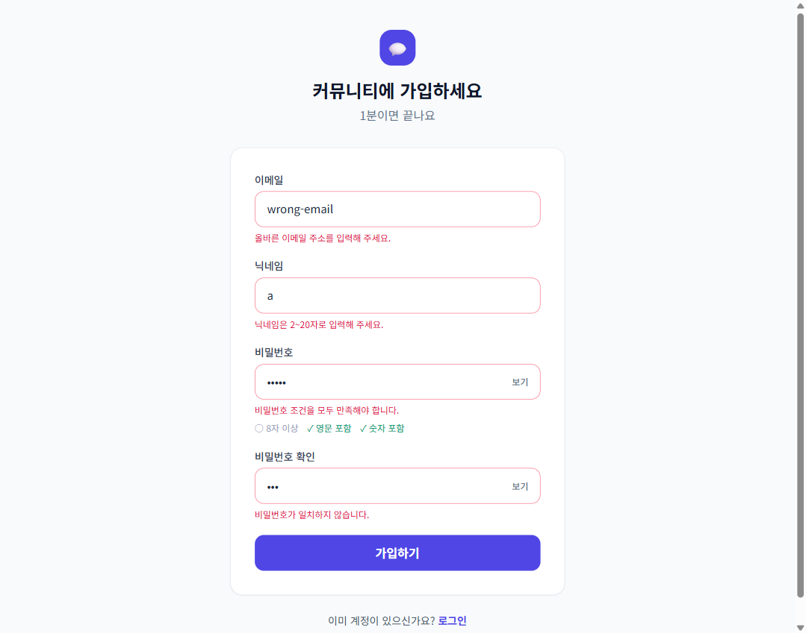
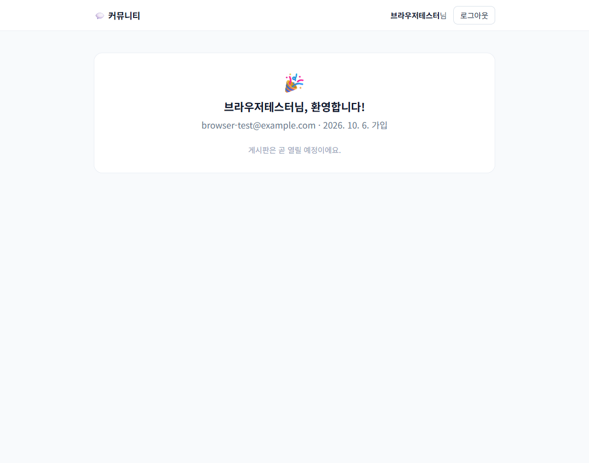
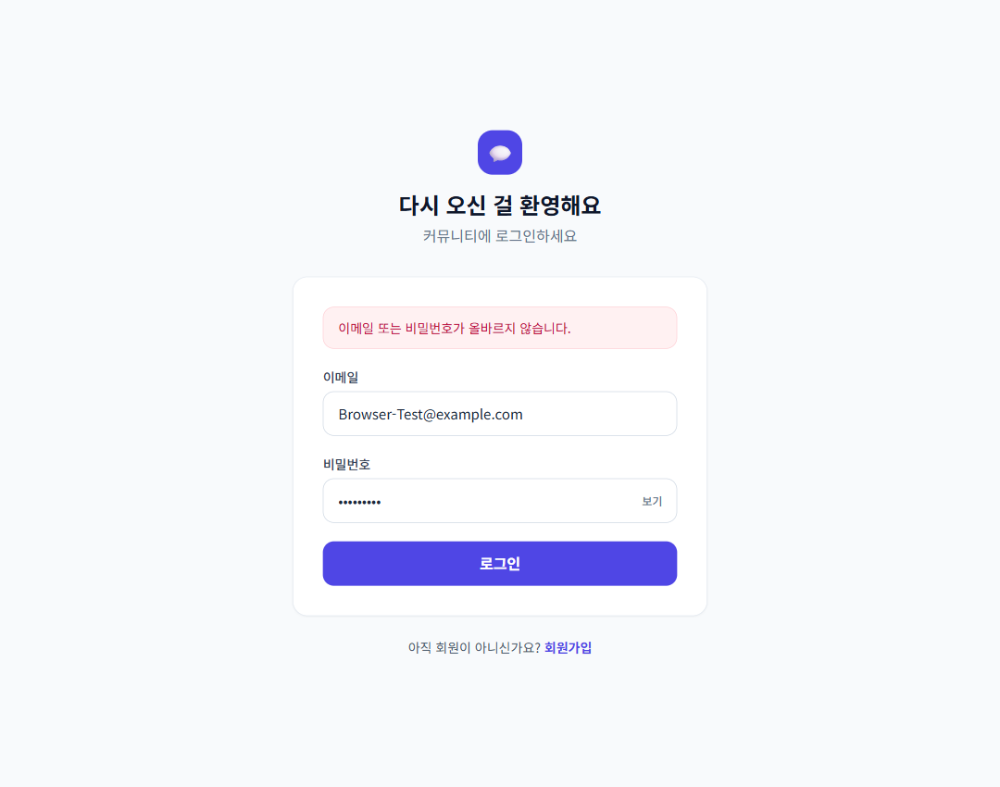
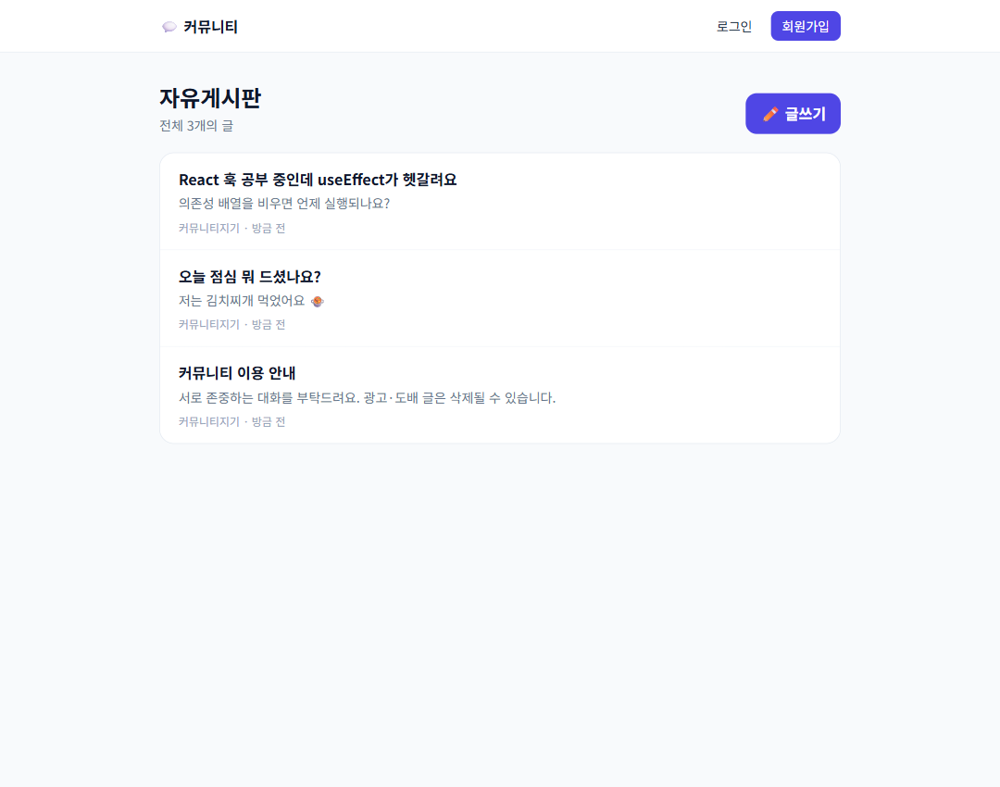
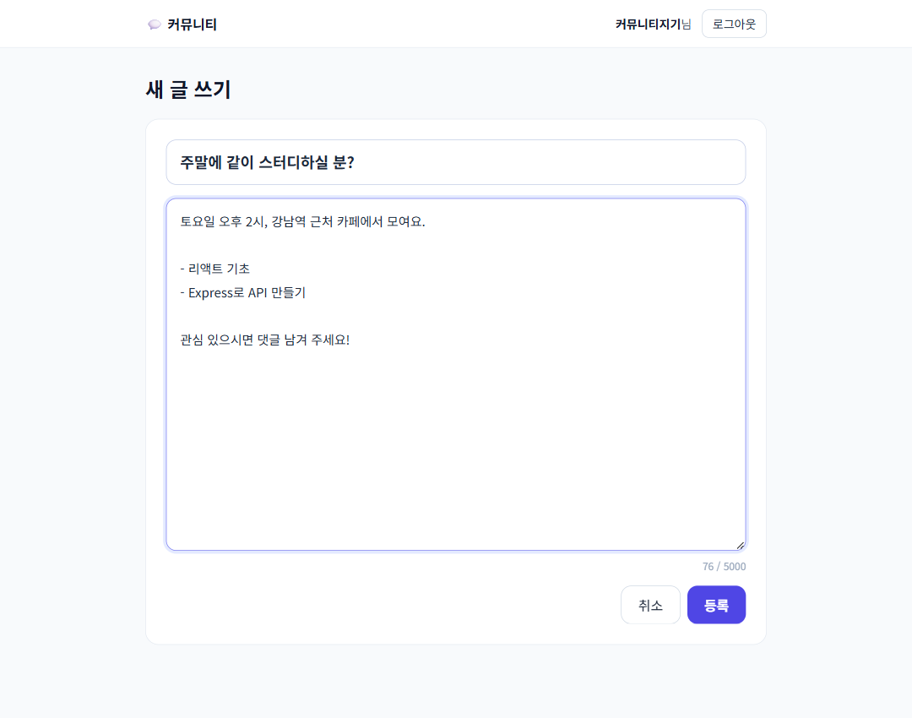
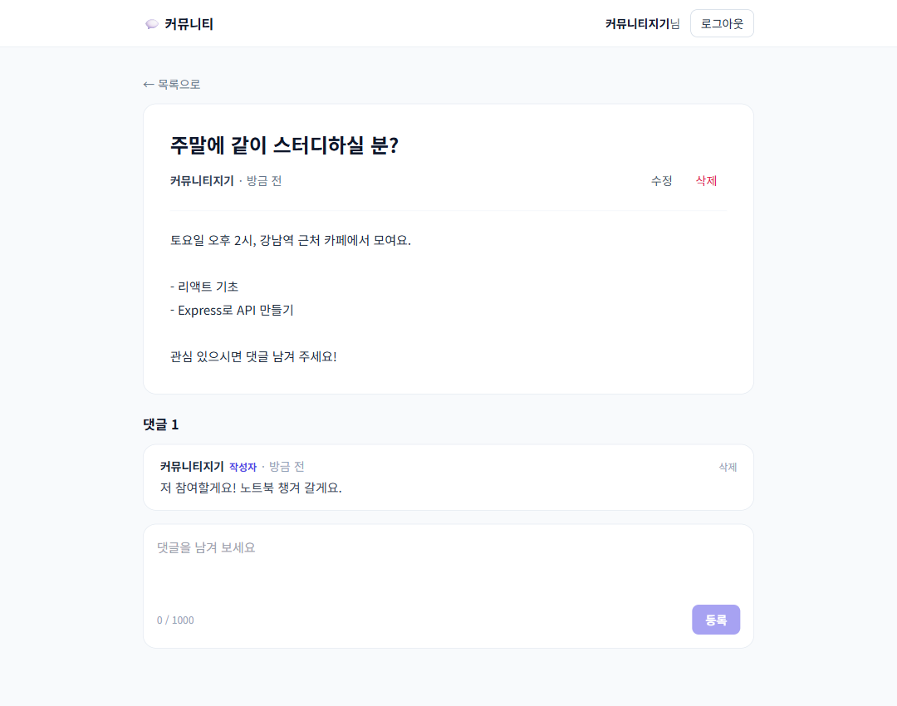

# 커뮤니티 — 회원가입·로그인 + 게시판

회원가입·로그인을 먼저 만들고, 그 위에 **자유게시판**(글 목록·읽기·쓰기·수정·삭제, 댓글)을 붙였습니다.
글 읽기는 비회원도 할 수 있고, 글·댓글 쓰기는 로그인한 사람만 할 수 있습니다.

- 프론트엔드: 단일 `index.html` (CDN React 18 · Babel Standalone · Tailwind)
- 백엔드: 단일 `server.js` (Express 5)
- DB: Supabase PostgreSQL — `community_users` · `community_posts` · `community_comments`
- 인증: 비밀번호는 **bcrypt 해시**로 저장, 로그인 상태는 **JWT**(7일)로 유지

| 회원가입 검증 | 로그인 후 홈 | 로그인 실패 |
|---|---|---|
|  |  |  |

| 게시판 목록 (비회원) | 글쓰기 | 글 + 댓글 |
|---|---|---|
|  |  |  |

> 02는 게시판을 붙이기 전의 임시 홈 화면입니다.

## 실행

```powershell
cd week-5/community
npm install
Copy-Item .env.example .env   # DATABASE_URL, JWT_SECRET 채우기
node -e "console.log(require('crypto').randomBytes(48).toString('hex'))"   # JWT_SECRET 생성
npm start                      # http://localhost:3000
```

테이블은 서버가 처음 요청을 받을 때 자동으로 만듭니다.

## 화면

| 주소 | 화면 | 비고 |
|---|---|---|
| `#/signup` | 회원가입 | 이메일·닉네임·비밀번호·비밀번호 확인. 가입하면 바로 로그인됩니다 |
| `#/login` | 로그인 | |
| `#/`, `#/page/2` | 글 목록 | 최신순 10개씩, 댓글 수 표시. 비회원도 볼 수 있습니다 |
| `#/posts/:id` | 글 + 댓글 | 내 글이면 수정·삭제 버튼, 내 댓글이면 삭제 버튼 |
| `#/write` | 글쓰기 | 🔒 로그인 필요 |
| `#/posts/:id/edit` | 글 수정 | 🔒 로그인 필요 (작성자만 저장 가능) |

🔒 화면에 비회원으로 들어오면 로그인 화면으로 보내고, **로그인하면 원래 가려던 화면으로 돌려보냅니다.**

## API

| 메서드 | 경로 | 설명 |
|---|---|---|
| POST | `/api/auth/signup` | `{ email, nickname, password }` → `{ token, user }` |
| POST | `/api/auth/login` | `{ email, password }` → `{ token, user }` |
| GET | `/api/auth/me` | `Authorization: Bearer <토큰>` → `{ user }` |
| GET | `/api/posts?page=1` | 글 목록 (본문은 앞 120자만) |
| GET | `/api/posts/:id` | 글 + 댓글 |
| POST | `/api/posts` | 🔒 `{ title, content }` 글 쓰기 |
| PATCH | `/api/posts/:id` | 🔒 글 수정 (작성자만) |
| DELETE | `/api/posts/:id` | 🔒 글 삭제 (작성자만, 댓글도 함께) |
| POST | `/api/posts/:id/comments` | 🔒 `{ content }` 댓글 쓰기 |
| DELETE | `/api/comments/:id` | 🔒 댓글 삭제 (작성자만) |
| GET | `/api/health` | DB 연결 확인 |

🔒 = `Authorization: Bearer <토큰>` 필요. 없으면 401, 남의 글·댓글이면 403.

응답 형태는 다른 앱과 같이 `{ success: true, data }` / `{ success: false, message }`입니다.

## 입력 규칙

- 이메일: 형식 검사 후 **소문자로 바꿔서** 저장 (`A@x.com`과 `a@x.com`을 같은 계정으로)
- 닉네임: 2~20자, 중복 불가
- 비밀번호: 8자 이상, 영문과 숫자 모두 포함
- 글: 제목 100자, 본문 5000자 / 댓글: 1000자 (앞뒤 공백을 잘라낸 뒤 비어 있으면 거부)

같은 규칙을 **화면과 서버 양쪽**에서 검사합니다. 화면 검사는 빠른 안내용이고,
브라우저를 거치지 않는 요청도 있으니 실제로 막는 건 서버입니다.

## 구현하면서 해결한 문제

### 1. 비밀번호를 그대로 저장하지 않는다
DB가 유출돼도 비밀번호가 드러나지 않도록 `bcryptjs`로 해시해 저장합니다.
bcrypt는 일부러 느리게(라운드 10) 만들어져 무차별 대입을 어렵게 하고, 해시마다
솔트가 들어가 같은 비밀번호라도 저장값이 다릅니다.
bcrypt는 **72바이트 이후를 무시**하므로 그보다 긴 비밀번호는 서버에서 막습니다.

### 2. 중복 가입은 SELECT가 아니라 UNIQUE 제약으로 막는다
"이미 있는지 SELECT → 없으면 INSERT"로 하면 두 요청이 동시에 오면 둘 다 통과할 수 있습니다.
그래서 `email`, `nickname`에 `UNIQUE` 제약을 걸고, INSERT가 실패하며 내는
에러 코드 `23505`를 잡아 **어느 제약이 걸렸는지**(`err.constraint`)로 "이메일"/"닉네임" 중
어떤 게 겹쳤는지 알려줍니다.

### 3. 로그인 실패 문구는 하나로 통일한다
"없는 이메일입니다"와 "비밀번호가 틀렸습니다"를 구분해 주면, 남이 어떤 이메일로
가입했는지 알아내는 데 쓰일 수 있습니다. 그래서 둘 다
"이메일 또는 비밀번호가 올바르지 않습니다."로 답합니다.

### 4. 새로고침해도 로그인이 유지되게
토큰을 `localStorage`에 두고, 앱이 켜질 때 `/api/auth/me`로 토큰이 아직 유효한지 확인합니다.
이때 **401일 때만 토큰을 지웁니다.** 서버가 잠깐 응답하지 않는 것만으로 로그아웃되면 불편하기 때문입니다.

> `localStorage`는 페이지에 악성 스크립트가 끼어들면(XSS) 토큰을 읽힐 수 있습니다.
> 학습용이라 단순한 쪽을 택했고, 실서비스라면 `httpOnly` 쿠키에 담는 편이 안전합니다.

### 5. 오류는 "건드린 칸"에만 보여준다
처음부터 모든 칸이 빨간색이면 불친절합니다. 칸을 벗어났을 때(`onBlur`) 또는 제출을 눌렀을 때부터
해당 칸의 오류를 표시하고, 비밀번호 조건은 입력하는 동안 ✓로 바로 보여줍니다.

### 6. "내 글인지"는 서버가 DB로 판단한다
화면에서는 `user.id === post.authorId`일 때만 수정·삭제 버튼을 보여주지만, 이건 **편의일 뿐 보안이 아닙니다.**
누구든 버튼 없이 `DELETE /api/posts/5`를 직접 보낼 수 있기 때문입니다.
그래서 서버는 토큰에서 꺼낸 사용자 id와 **DB에 저장된 `user_id`**를 비교해 다르면 403으로 거절합니다(`assertOwner`).

### 7. 글을 지우면 댓글도 — `ON DELETE CASCADE`
댓글 테이블의 `post_id`에 `ON DELETE CASCADE`를 걸어, 글을 지우면 DB가 댓글을 알아서 함께 지웁니다.
회원을 지우면 그 사람의 글·댓글도 같은 방식으로 지워집니다. 테스트 계정을 정리할 때 실제로 이렇게 동작하는 걸 확인했습니다.

### 8. 로그인 후 "원래 가려던 곳"으로 — 이동을 한 곳에서만
비회원이 글쓰기를 누르면 로그인 화면으로 보내고, 로그인 후 글쓰기로 돌아오게 했습니다.
처음에는 로그인 성공 처리(`onAuth`)에서 `go('/write')`를 하고, 라우트 가드에도
"로그인한 사람이 `/login`에 있으면 홈으로" 규칙이 있었는데, **가드가 나중에 실행되어 홈으로 덮어썼습니다.**
이동을 라우트 가드 한 곳에서만 하도록 바꿔 해결했습니다.

### 9. 본문은 그대로 문자열로 — XSS 걱정 없이 줄바꿈만 살리기
글 본문에 `<script>`가 들어와도 React는 `{post.content}`를 **문자열로** 넣기 때문에 실행되지 않습니다.
`dangerouslySetInnerHTML`을 쓰지 않고, 줄바꿈은 CSS `white-space: pre-wrap`으로만 살렸습니다.

### 10. URL의 id는 먼저 숫자인지 확인한다
`/api/posts/abc`를 그대로 쿼리에 넣으면 Postgres가 형변환 오류(22P02)를 내서 500이 됩니다.
`parseId`에서 양의 정수가 아니면 바로 404로 답합니다.

## 배포 (Vercel)

**배포 주소: https://afm-community-kappa.vercel.app**

`.vercelignore`로 `.env`·`node_modules`·`screenshots`를 업로드에서 뺐습니다.
운영용 `JWT_SECRET`은 로컬과 **다른 값**을 새로 만들어 등록했습니다 (로컬 토큰으로 운영에 로그인되지 않도록).


```powershell
npx vercel env add DATABASE_URL production
npx vercel env add JWT_SECRET production
npx vercel --prod
```

`JWT_SECRET`을 바꾸면 기존에 발급된 토큰은 모두 무효가 되어 다시 로그인해야 합니다.
