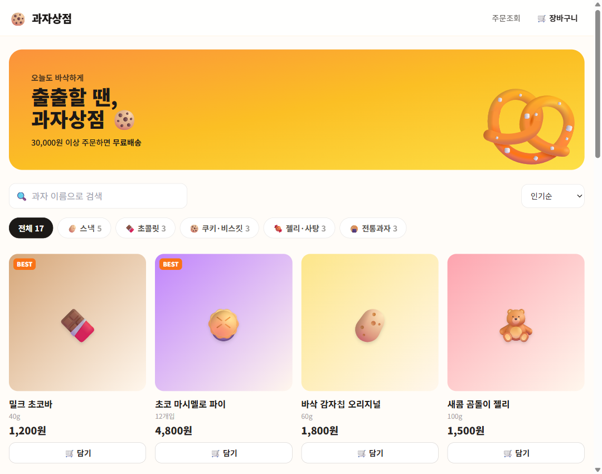
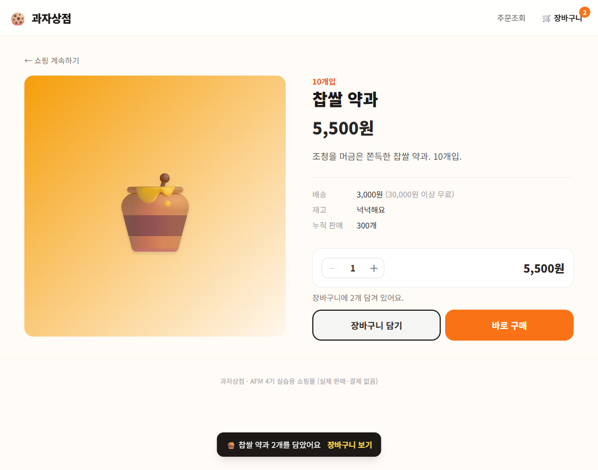
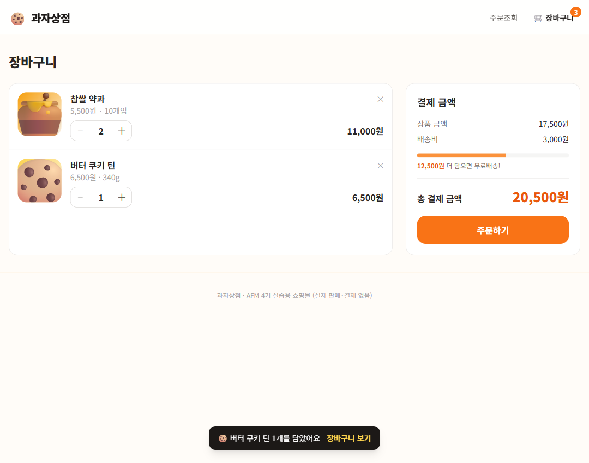
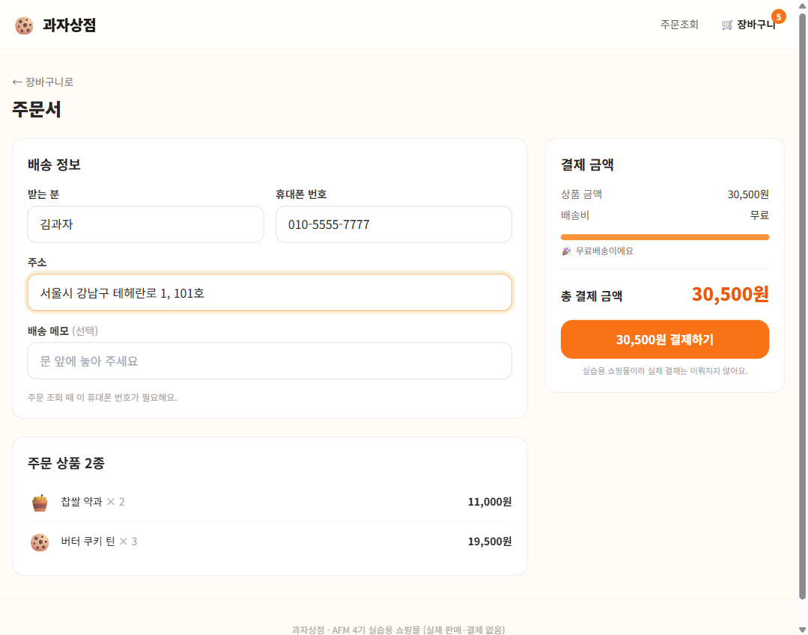
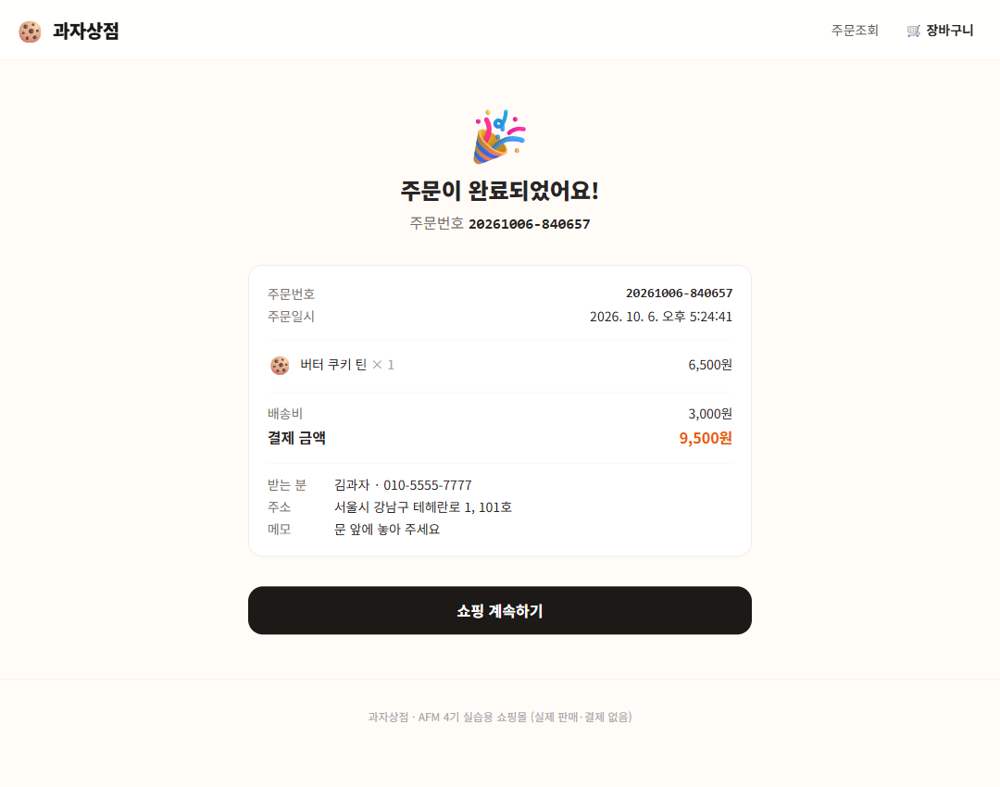
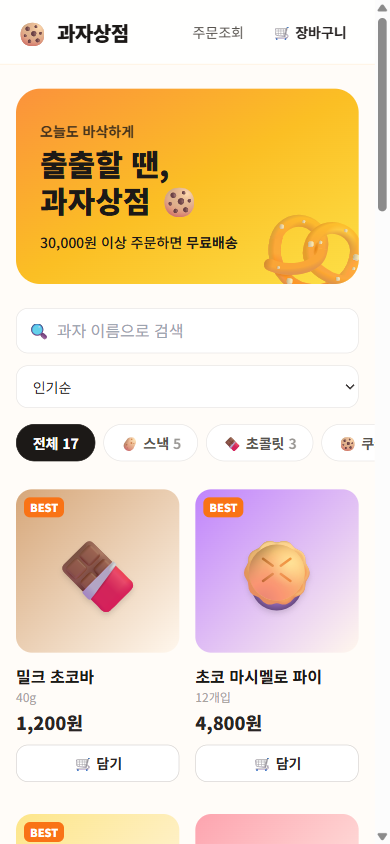
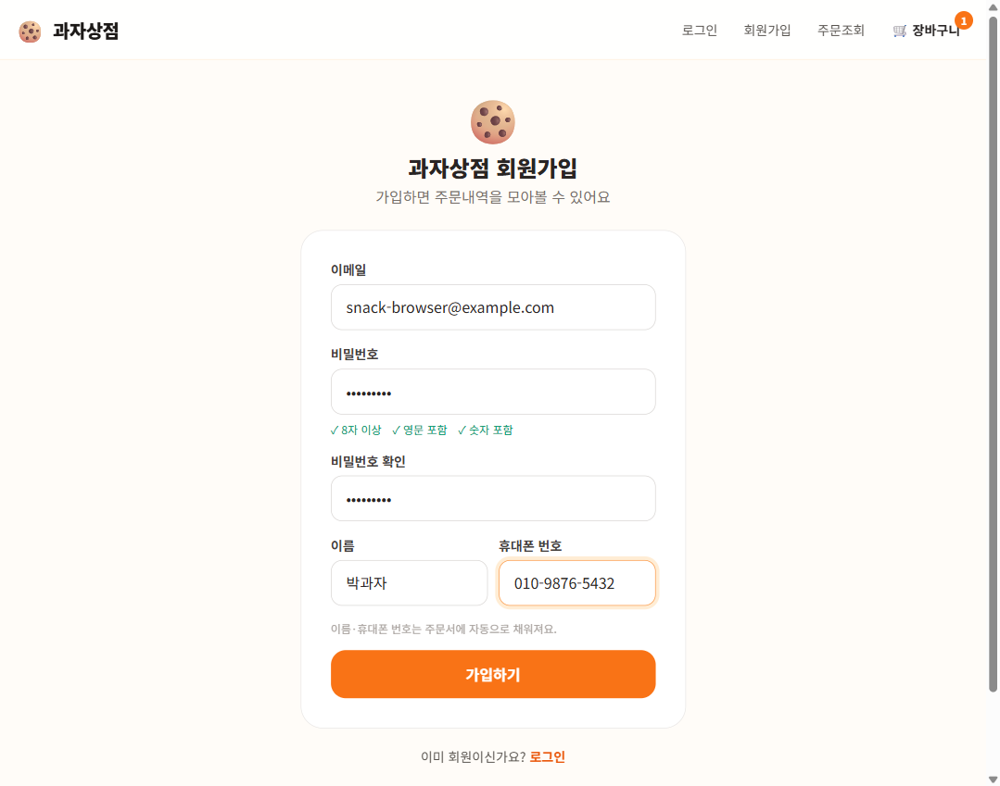
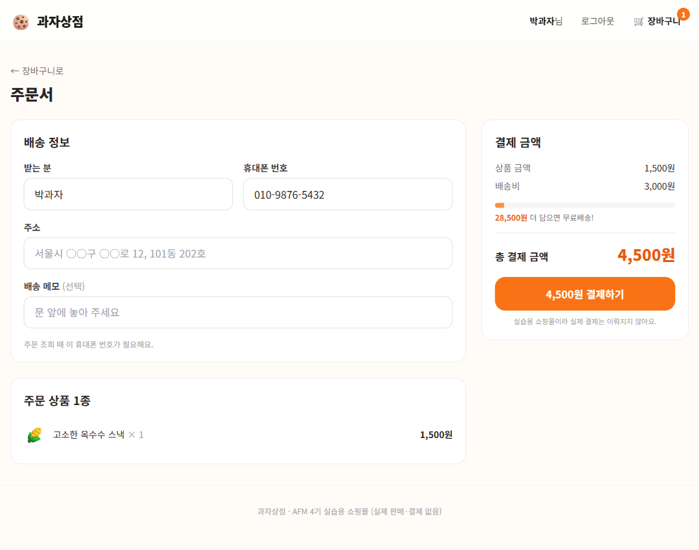
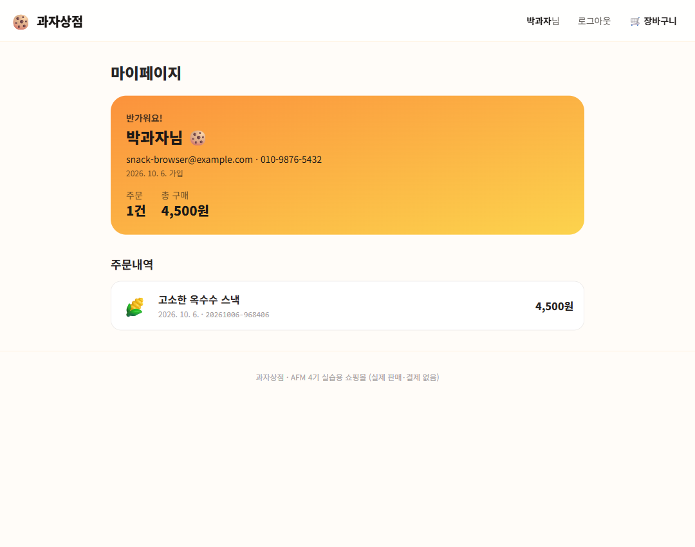

# 과자상점 — 과자 쇼핑몰

과자를 고르고, 장바구니에 담고, 주문하고, 주문을 조회하는 쇼핑몰입니다. (실습용이라 실제 결제는 없습니다)
회원가입하면 주문서에 이름·전화번호가 자동으로 채워지고, 마이페이지에서 주문내역을 모아볼 수 있습니다. 비회원 주문도 됩니다.

**배포 주소: https://afm-snack-shop.vercel.app**

- 프론트엔드: 단일 `index.html` (CDN React 18 · Babel Standalone · Tailwind)
- 백엔드: 단일 `server.js` (Express 5)
- DB: Supabase PostgreSQL — `snack_products` · `snack_orders` · `snack_order_items` · `snack_users`
- 인증: 비밀번호는 bcrypt 해시로 저장, 로그인 상태는 JWT(7일)

| 메인 | 상품 상세 | 장바구니 |
|---|---|---|
|  |  |  |

| 주문서 | 주문 완료 | 휴대폰 화면 |
|---|---|---|
|  |  |  |

| 회원가입 | 주문서 (회원, 자동 채움) | 마이페이지 |
|---|---|---|
|  |  |  |

## 실행

```powershell
cd week-5/snack-shop
npm install
Copy-Item .env.example .env   # DATABASE_URL, JWT_SECRET 채우기
npm start                      # http://localhost:3200
```

테이블은 서버가 처음 요청을 받을 때 만들고, 상품 테이블이 비어 있으면 과자 17종을 넣습니다.

## 화면

| 주소 | 화면 |
|---|---|
| `#/` | 상품 목록 — 카테고리 5종, 검색, 정렬(인기·신상품·가격), BEST·품절·"n개 남음" 배지 |
| `#/products/:id` | 상품 상세 — 수량 선택, 장바구니 담기, 바로 구매 |
| `#/cart` | 장바구니 — 수량 변경·삭제, 무료배송까지 남은 금액 표시 |
| `#/checkout` | 주문서 — 받는 분·휴대폰·주소·메모 |
| `#/orders/:주문번호/complete` | 주문 완료 |
| `#/lookup` | 주문조회 — 주문번호 + 휴대폰 번호 (비회원용) |
| `#/signup` · `#/login` | 회원가입 · 로그인 — 끝나면 원래 있던 화면(예: 주문서)으로 돌아갑니다 |
| `#/mypage` | 내 정보 · 주문 수 · 총 구매액 · 주문내역 (로그인 필요) |

배송비 3,000원, **30,000원 이상 무료배송**.

## API

| 메서드 | 경로 | 설명 |
|---|---|---|
| GET | `/api/categories` | 카테고리 + 상품 수 |
| GET | `/api/products?category=&q=&sort=` | 상품 목록 (`sort`: popular·new·price_asc·price_desc) |
| GET | `/api/products/:id` | 상품 상세 |
| POST | `/api/cart/quote` | `{ items: [{ productId, quantity }] }` → 현재 가격·재고로 계산한 금액 |
| POST | `/api/orders` | `{ items, customer: { name, phone, address, memo } }` → `{ orderNo, total }` |
| GET | `/api/orders/:orderNo?phone=` | 주문 조회 (전화번호가 맞아야 함) |
| POST | `/api/auth/signup` | `{ email, password, name, phone }` → `{ token, user }` |
| POST | `/api/auth/login` | `{ email, password }` → `{ token, user }` |
| GET | `/api/me` | 🔒 내 정보 |
| GET | `/api/me/orders` | 🔒 내 주문내역 (최근 50건) |
| GET | `/api/health` | DB 연결 확인 |

🔒 = `Authorization: Bearer <토큰>` 필요. `POST /api/orders`는 토큰이 있으면 주문을 그 회원에게 연결합니다.

## 구현하면서 해결한 문제

### 1. 금액은 서버가 계산한다
장바구니는 브라우저(`localStorage`)에 **상품 id와 수량만** 저장합니다. 가격까지 저장하면
가격이 바뀌었을 때 옛 가격이 남고, 누군가 값을 고쳐 1원에 주문할 수도 있습니다.
그래서 장바구니·주문서 화면은 `/api/cart/quote`로, 주문은 `/api/orders`에서 **DB의 현재 가격으로** 다시 계산합니다.

### 2. 동시에 주문이 몰려도 재고 이상 팔지 않는다 — 트랜잭션 + `FOR UPDATE`
"재고 확인 → 차감" 사이에 다른 주문이 끼어들면 같은 재고를 두 번 팔 수 있습니다.
주문 전체를 `BEGIN … COMMIT`으로 묶고, 상품 행을 `SELECT … FOR UPDATE`로 잠가서
먼저 온 주문이 끝날 때까지 다음 주문이 기다리게 했습니다.
여러 상품을 잠글 때는 **id 순서로** 잠가 두 주문이 서로를 기다리는 교착(deadlock)을 피합니다.
또 `stock` 컬럼에 `CHECK (stock >= 0)`을 걸어, 코드가 실수해도 DB가 음수 재고를 거부합니다.

> 재고 5개인 상품에 2개씩 5건을 **동시에** 주문해 확인했습니다 → 2건 성공, 3건 "n개까지 주문할 수 있습니다", 남은 재고 1개.

### 3. 주문 당시의 상품명·가격을 복사해 둔다
`snack_order_items`에 상품 id뿐 아니라 이름·가격도 저장합니다. 나중에 상품 가격이 바뀌거나
이름이 바뀌어도 지난 주문 내역은 주문한 그대로 보여야 하기 때문입니다.

### 4. 주문번호는 추측하기 어렵게, 조회는 전화번호까지
주문번호를 `1, 2, 3…`으로 주면 남의 주문을 쉽게 들춰볼 수 있습니다.
`날짜-무작위6자리`(예: `20261006-482913`)로 만들고, 조회할 때는 **주문 때 쓴 전화번호까지 맞아야** 보여줍니다.
번호가 없는 경우와 전화번호가 틀린 경우는 같은 문구로 답합니다.
무작위 번호가 우연히 겹치면(UNIQUE 위반) `SAVEPOINT`로 그 INSERT만 되돌리고 번호를 바꿔 다시 시도합니다.

### 5. 정렬·검색에서 SQL 주입 막기
`ORDER BY`에는 `$1` 같은 파라미터를 쓸 수 없어서, 사용자가 보낸 `sort` 값을 SQL에 그대로 넣으면 위험합니다.
정해진 목록(`SORTS`)에서만 골라 쓰고, 모르는 값이면 인기순으로 처리합니다.
검색어의 `%`·`_`는 LIKE의 와일드카드라 이스케이프해서 글자 그대로 찾게 했습니다 ("70%" 검색 → 다크 초콜릿 70%만).

### 6. 주문 완료 화면 대신 장바구니로 가던 버그
주문서에는 "장바구니가 비어 있으면 장바구니 화면으로 보내기" 처리가 있었는데, 주문에 성공해 장바구니를 비우는
순간에도 이 처리가 실행되어 완료 화면 이동을 덮어썼습니다. **주문서에 처음 들어올 때만** 검사하도록 바꿨습니다.
(커뮤니티 앱의 "로그인 후 원래 화면으로" 버그와 같은 유형 — 화면 이동이 두 곳에서 일어나면 나중 것이 이깁니다)

### 7. 회원 주문과 비회원 주문을 함께 받는다
`snack_orders`에 `user_id` 컬럼을 추가했습니다. 비회원 주문은 `NULL`이고, 회원이 탈퇴해도 주문 기록은
남아야 하므로 `ON DELETE SET NULL`로 걸었습니다. 회원 기능이 주문 테이블보다 나중에 생겼기 때문에
`ALTER TABLE … ADD COLUMN IF NOT EXISTS`로 붙여서, 이미 배포된 DB에도 그대로 적용됩니다.

주문 API는 로그인이 **선택**입니다(`optionalAuth`). 다만 토큰을 보냈는데 만료됐다면 조용히 비회원 주문으로
바꾸지 않고 401로 알려 다시 로그인시킵니다 — 회원으로 주문했다고 생각했는데 내 주문내역에 안 보이는 일을 막기 위해서입니다.

### 8. 주문서에서 로그인하면 주문서로 돌아오고, 이름·전화번호가 채워진다
비회원으로 주문서까지 왔다가 로그인(또는 회원가입)하면 다시 주문서로 돌아옵니다. 이동은 커뮤니티 앱에서 배운 대로
**라우트 가드 한 곳에서만** 합니다. 주문서 컴포넌트에 `key={user.id}`를 줘서, 로그인 직후 컴포넌트를 새로 만들어
가입 때 적은 이름·전화번호가 채워지게 했습니다.

### 9. 내 주문내역은 쿼리 두 번으로
주문 목록을 가져온 뒤 주문마다 상품을 따로 조회하면 주문 수만큼 쿼리가 나갑니다(N+1 문제).
주문 id 목록으로 `order_id = ANY($1)` 한 번에 상품을 가져와 서버에서 주문별로 나눴습니다.

### 10. 상품 사진 대신 이모지 + 그라데이션
이미지 파일 없이도 쇼핑몰처럼 보이도록, 상품마다 이모지와 배경색을 DB에 두고 카드로 그렸습니다.

## 배포 (Vercel)

```powershell
npx vercel env add DATABASE_URL production
npx vercel env add JWT_SECRET production   # 로컬과 다른 값으로
npx vercel --prod
```

Vercel 팀 `afm-4`의 프로젝트 `afm-snack-shop`. `.vercelignore`로 `.env`·`node_modules`·`screenshots`는 업로드하지 않습니다.
로컬과 배포 사이트가 **같은 Supabase DB**를 쓰므로, 로컬에서 테스트로 주문하면 배포 사이트 재고도 줄어듭니다.
